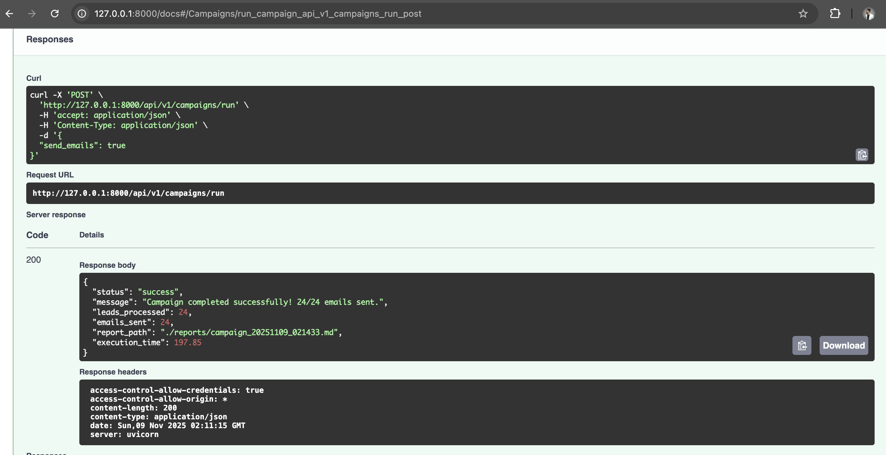

# CRM Sales Automation

An AI-powered CRM system for automated sales lead processing and outreach campaigns.

## Overview

This project is a sophisticated sales automation system that combines CRM functionality with AI capabilities. It processes leads through an intelligent pipeline that includes lead scoring, enrichment, and automated personalized outreach.

## Features

- 🤖 **AI-Powered Lead Processing**
  - Automated lead scoring and prioritization
  - AI-driven persona enrichment
  - Personalized outreach content generation

- 📧 **Email Automation**
  - Automated email campaign execution
  - Personalized email content
  - SMTP integration

- 📊 **Campaign Management**
  - Lead processing pipeline
  - Campaign reporting
  - Batch processing capabilities

- 🔄 **API Integration**
  - RESTful API endpoints
  - FastAPI-powered backend
  - Async processing support

## Tech Stack

- **Framework**: FastAPI
- **AI/LLM**: Groq (llama-3.1-8b-instant model)
- **Data Processing**: Pandas
- **Validation**: Pydantic
- **Email**: SMTP via aiosmtplib
- **Containerization**: Docker

## Getting Started

### Prerequisites

- Python 3.8+
- Docker (optional)
- SMTP server access

### Installation

1. Clone the repository:
```bash
git clone https://github.com/Asif734/CRM-Sales_Automation.git
cd CRM-Sales_Automation
```

2. Create a virtual environment:
```bash
python -m venv venv
source venv/bin/activate  # Linux/Mac
.\venv\Scripts\activate   # Windows
```

3. Install dependencies:
```bash
pip install -r requirements.txt
```

4. Create .env file with required configuration:
```env
GROQ_API_KEY=your_api_key
SMTP_HOST=your_smtp_host
SMTP_PORT=your_smtp_port
SMTP_FROM_EMAIL=your_from_email
SMTP_FROM_NAME=your_from_name
```

### Running the Application

#### Local Development

```bash
uvicorn app.run:app --reload
```

#### Using Docker

```bash
docker-compose up --build
```

## Usage

1. Prepare your leads data in CSV format in `data/leads.csv`
2. Access the API endpoints:
   - `POST /campaign/start`: Start a new campaign
   - `GET /leads`: Get processed leads
   - `GET /health`: Check system health

## Project Structure

```
app/
├── agents/         # AI agents for scoring, enrichment, and outreach
├── core/          # Core business logic and pipeline
├── routes/        # API endpoints
├── services/      # Business services
└── utils/         # Utility functions
```

## Configuration

Key configuration options in `app/config.py`:

- `groq_model`: LLM model selection
- `batch_size`: Number of leads to process in parallel
- `max_retries`: Maximum retry attempts for failed operations
- `log_level`: Logging verbosity

## API Documentation

Once the application is running, access the API documentation at:
- Swagger UI: `http://localhost:8000/docs`
- ReDoc: `http://localhost:8000/redoc`

## Reports

Campaign reports are automatically generated in the `reports/` directory in Markdown format, containing:
- Campaign statistics
- Processed leads summary
- Success/failure metrics

## Contributing

1. Fork the repository
2. Create your feature branch (`git checkout -b feature/AmazingFeature`)
3. Commit your changes (`git commit -m 'Add some AmazingFeature'`)
4. Push to the branch (`git push origin feature/AmazingFeature`)
5. Open a Pull Request

## License

This project is licensed under the MIT License - see the LICENSE file for details.


## Screenshot of fastapi swagger

